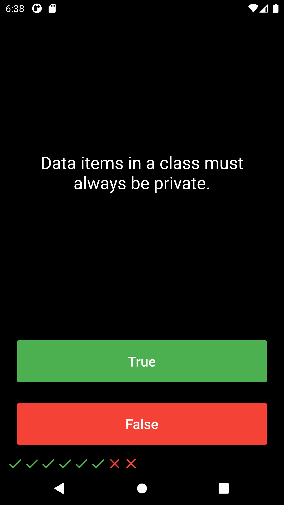
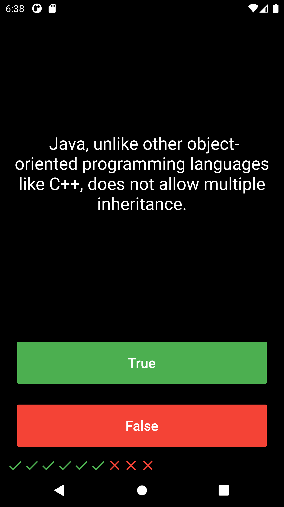
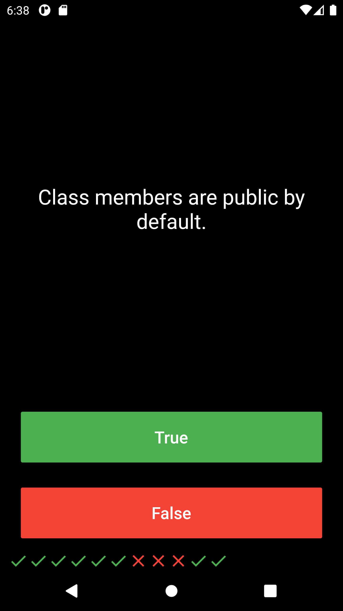

# Quizzler
Quizzler is an interactive platform to play quizzes and test your knowledge of a particular domain. This application displays the user the number of questions he/she has got right or wrong in a unique way with the use of icons.

  

  

  

  

